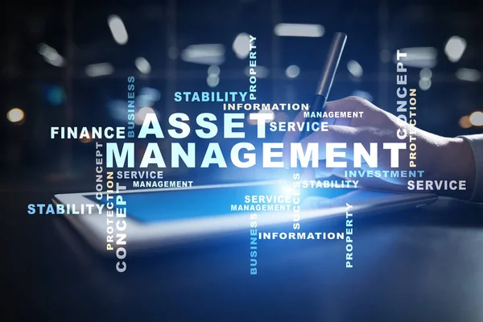
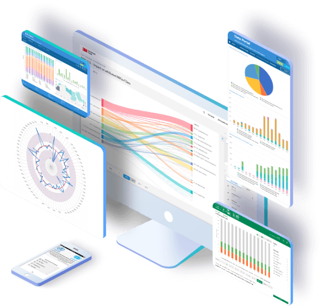
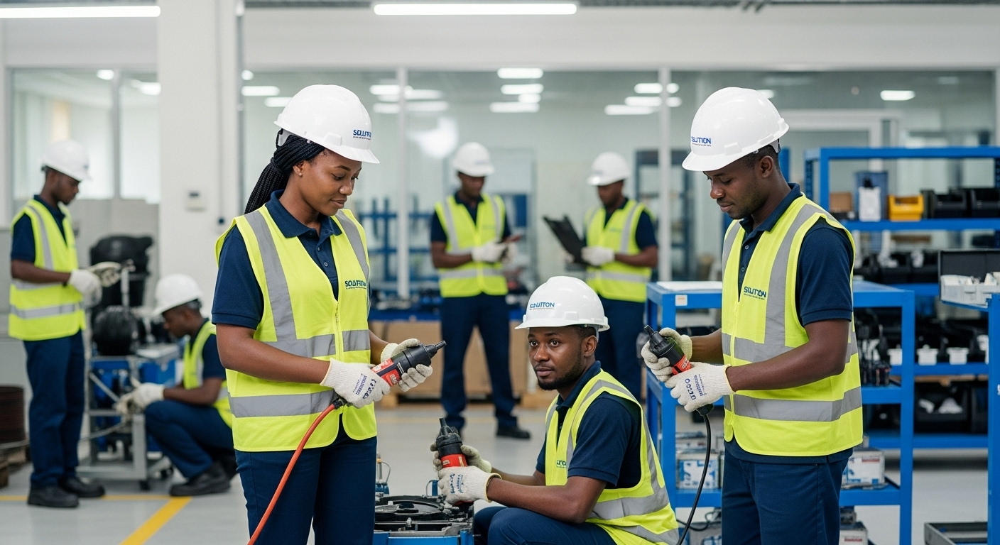
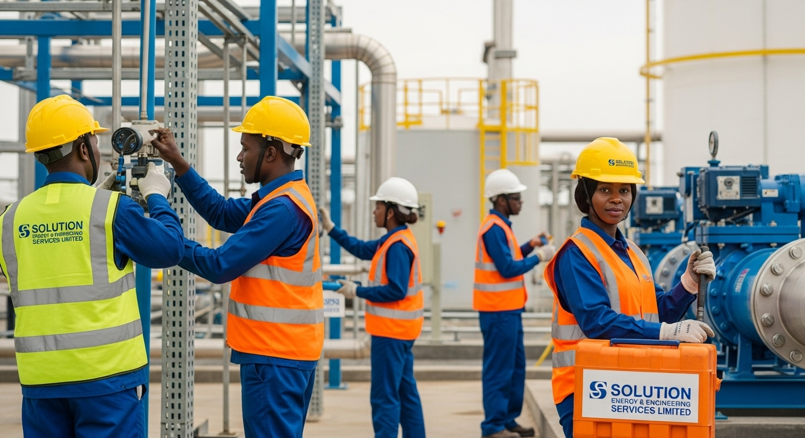
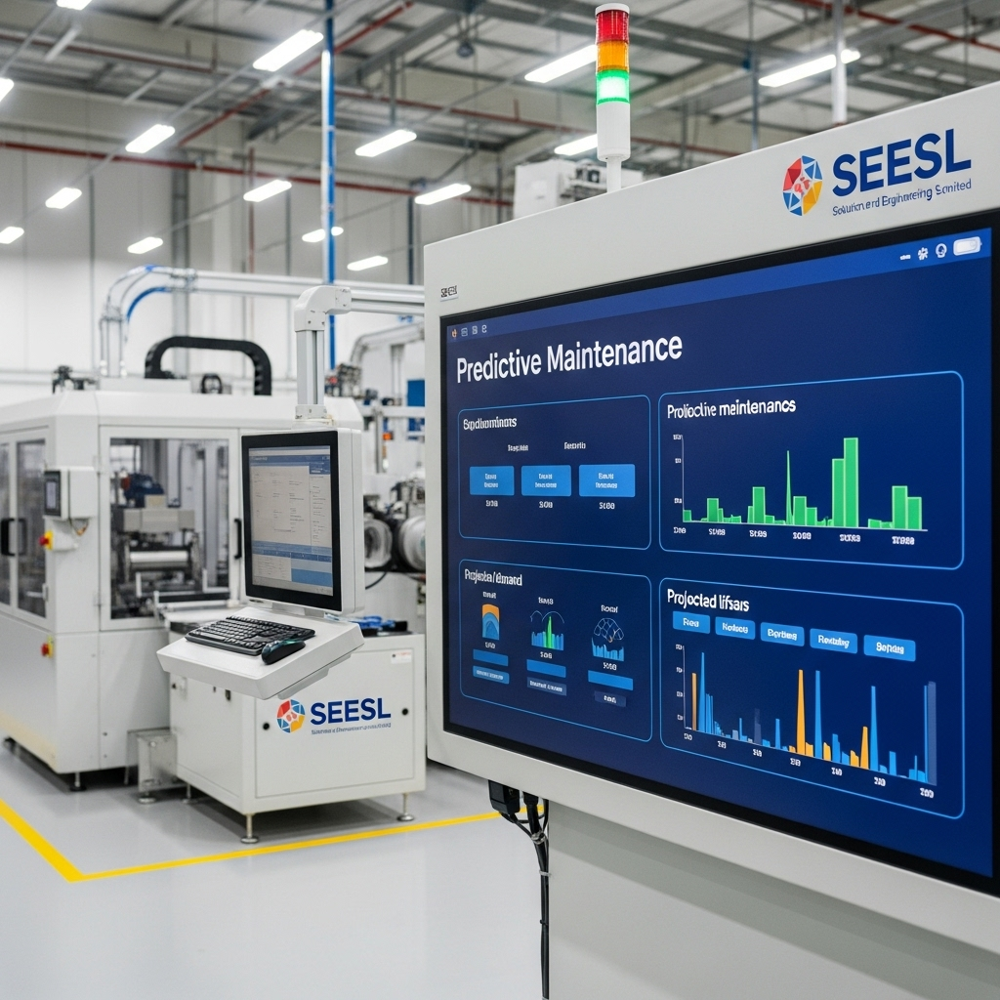
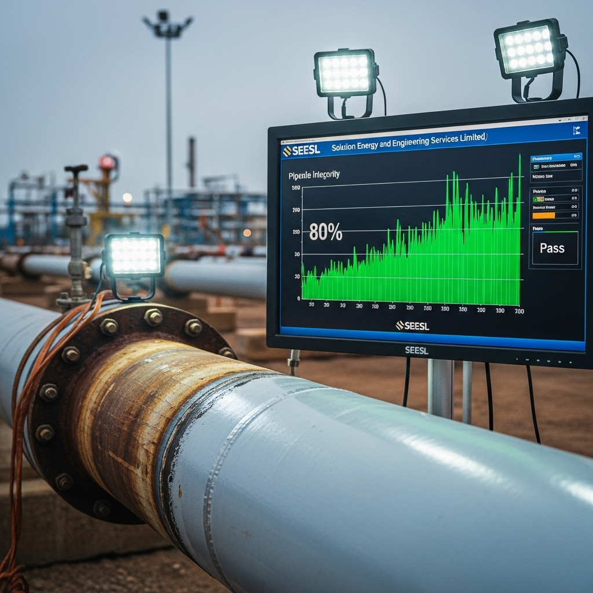
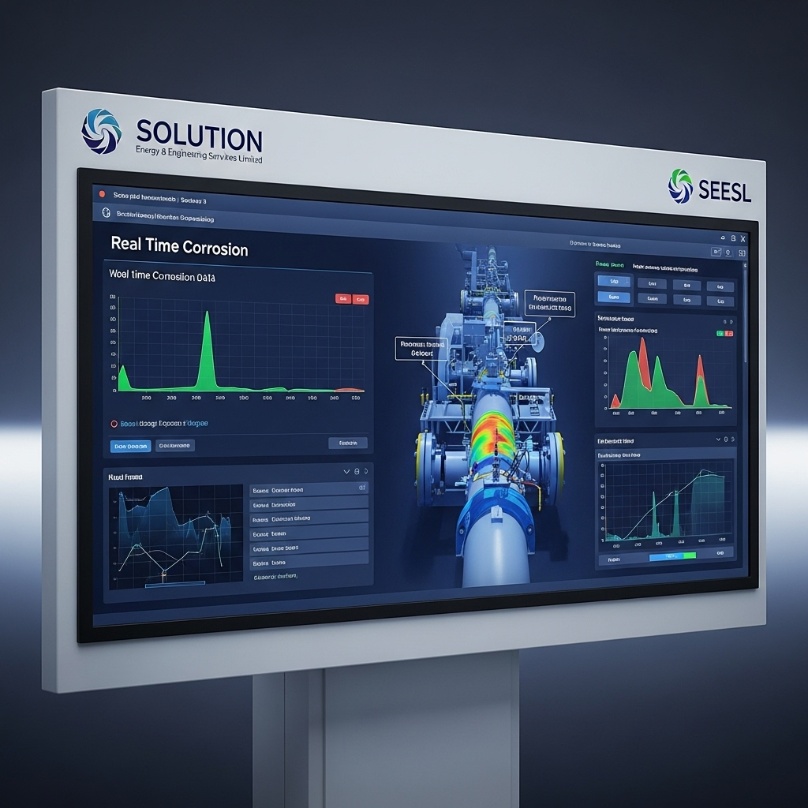

## Asset Integrity & Management Services

Our services focus on ensuring that assets perform their intended function over their life cycle—balancing design, maintenance, and cost-effectiveness.

  * __ Corrosion Monitoring & Prevention
  * __ Automated Corrosion Mapping
  * __ Cathodic Protection
  * __ Inspection Services
  * __ Non-Destructive Testing
  * __ Remaining-Life Assessment
  * __ Material Testing
  * __ Regular Monitoring
  * __ Calibration Services

## What We Bring to the Table

#### Digital Monitoring Systems

24/7 remote asset surveillance and predictive analytics for proactive maintenance.

#### Preventive Maintenance Tools

Advanced tools and techniques to extend asset lifespan and optimize performance.

#### Smart Analytics Dashboard

Real-time performance insights and data visualization for smarter decision-making.

## Facility Maintenance Services

We uphold safety and precision using modern automated systems for high-risk environments in the energy sector.

### Our Services Cover:

  * __Overhaul, repair & recertification of mechanical and process modules
  * __Sectional or entire pipeline or piping replacement
  * __Electrical & instrumentation maintenance & installation
  * __Coating/painting & surface protection services
  * __Routine lubrication of all moving parts
  * __Replacement of valves, pumps etc.
  * __Regular inspections of lighting systems
  * __Scaffolding and Rope Access Services

## Client Success Stories

Recovered 80% of failing pipeline integrity at XYZ Facility.

Implemented AI-powered corrosion tracking for ABC Group.

Reduced facility downtime by 45% through predictive maintenance.

Recovered 80% of failing pipeline integrity at XYZ Facility.

Implemented AI-powered corrosion tracking for ABC Group.

Reduced facility downtime by 45% through predictive maintenance.

## Ready to optimize your asset management?

Contact us today to discuss how our solutions can improve your performance and safety.

[Contact Us](../contact.html)