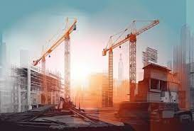
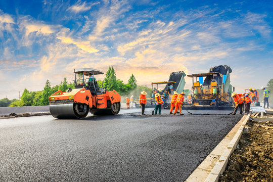
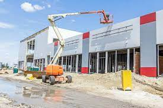
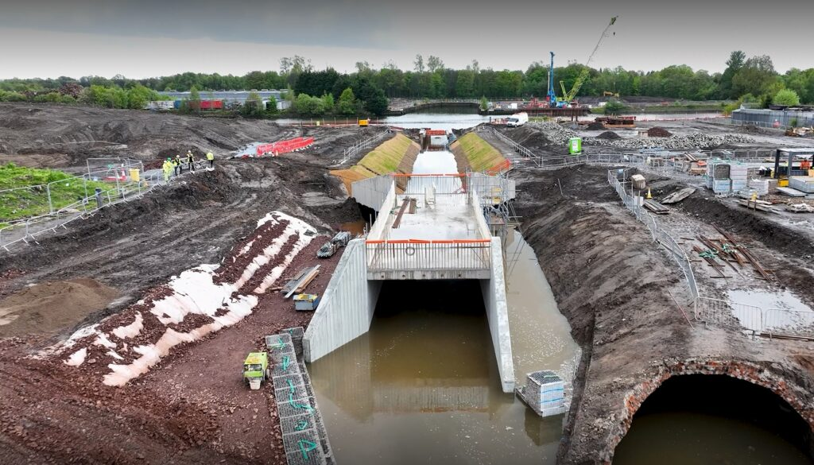
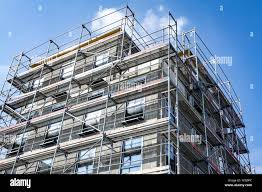

## Civil Construction Expertise

We are well prepared to undertake your civil works, delivering timely and effectively implementing the highest engineering standard as specified by COREN both for road construction and civic edifice.

### Our Civil Construction Services Include:

  * __Robotic cleaning of High-Rise buildings
  * __Automated Painting of high-rise buildings
  * __Road Constructions
  * __Construction of Pavements/Embarkments/Water-Channels
  * __Construction of public edifice (Schools, Hospitals, Worship centres etc.)
  * __Global facility maintenance

## Our Projects

History of previous jobs which we have executed directly and in joint partnership with other established firms.

### Road Construction

Modern road construction with proper drainage systems and durable materials.

### Public Edifice Construction

Design and construction of public buildings with focus on durability and functionality.

### Water Channel Construction

Efficient water channel systems designed to prevent flooding and erosion.

### High-Rise Building Maintenance

Robotic cleaning and automated painting of high-rise buildings ensuring safety and efficiency.

## Our Construction Process

01

### Initial Consultation

We meet with clients to understand project requirements, goals, and constraints.

02

### Design & Planning

Our team develops comprehensive designs and construction plans following engineering standards.

03

### Material Selection

We source high-quality, durable materials that meet project specifications and environmental standards.

04

### Construction

Our experienced team executes the project with precision, adhering to safety protocols and quality standards.

05

### Quality Assurance

Regular inspections ensure all work meets the highest standards of quality and compliance.

06

### Project Completion

We deliver finished projects on time and provide comprehensive documentation and support.

## Ready to start your construction project?

Contact us today to discuss how our civil construction services can help bring your vision to life.

[Contact Us](../contact.html)