# Engineering Services

[Explore Services](../index.html#services) [Contact Us](../contact.html)

## Engineering Excellence

Comprehensive engineering solutions for complex industrial challenges

At SEESL, we provide comprehensive engineering services to support your project from concept to completion. Our team of experienced engineers combines technical expertise with industry knowledge to deliver solutions that meet your specific requirements.

Our engineering services encompass Front End Engineering Design (FEED), detailed engineering, fabrication, construction, installation, and commissioning. We work across various industries, including oil and gas, manufacturing, power generation, and more, ensuring that each project is executed to the highest standards of quality and safety.

We pride ourselves on our ability to tackle complex engineering challenges, developing innovative solutions that optimize performance, enhance efficiency, and ensure long-term reliability. Whether you need support for a new development or improvements to existing facilities, our team has the expertise to deliver results.

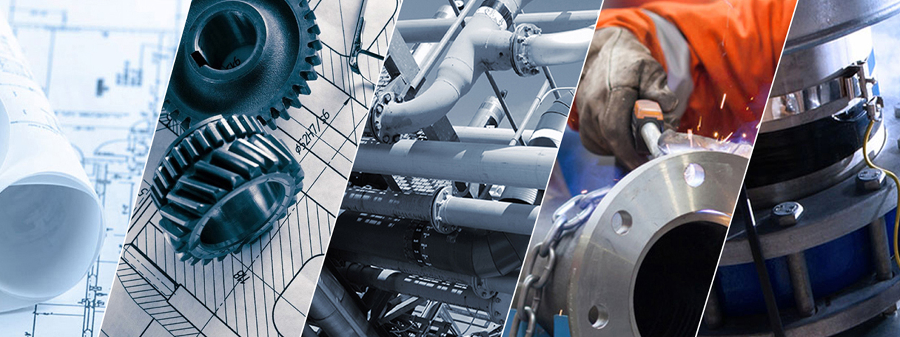

## Our Engineering Services

__

### Front End Engineering Design (FEED)

Our FEED services lay the foundation for successful project execution. We develop detailed designs and specifications that define the technical requirements, cost estimates, and implementation strategies for your project.

  * __Conceptual design and feasibility studies
  * __Process flow diagrams and P &IDs
  * __Equipment specifications and data sheets
  * __Preliminary cost estimates and schedules

__

### Fabrication Services

We offer high-quality fabrication services for various components and structures. Our skilled technicians and state-of-the-art facilities ensure precision manufacturing to meet your specifications.

  * __Structural steel fabrication
  * __Pressure vessel and tank fabrication
  * __Piping and spool fabrication
  * __Custom equipment fabrication

__

### Construction Services

Our construction services cover a wide range of industrial and civil projects. We manage all aspects of the construction process, ensuring timely delivery and adherence to quality and safety standards.

  * __Industrial plant construction
  * __Equipment and system installation
  * __Piping and mechanical works
  * __Electrical and instrumentation installation

__

### Installation Services

We provide expert installation services for a variety of equipment and systems. Our team ensures proper installation according to design specifications and manufacturer guidelines.

  * __Equipment installation and alignment
  * __Piping system installation
  * __Electrical and control system installation
  * __HVAC and utility system installation

__

### Commissioning Services

Our commissioning services ensure that installed equipment and systems function as designed. We conduct thorough testing and verification to confirm operational readiness before handover.

  * __Pre-commissioning checks and preparation
  * __Functional testing and system integration
  * __Performance testing and optimization
  * __Operator training and handover documentation

__

### Process Engineering

Our process engineering services focus on optimizing industrial processes to improve efficiency, reduce costs, and enhance product quality. We apply our technical expertise to solve complex process challenges.

  * __Process design and optimization
  * __Heat and material balance calculations
  * __Process simulation and modeling
  * __Process troubleshooting and improvement

## Our Projects

See our work in action across various sectors and industries

### Industrial Plant Expansion

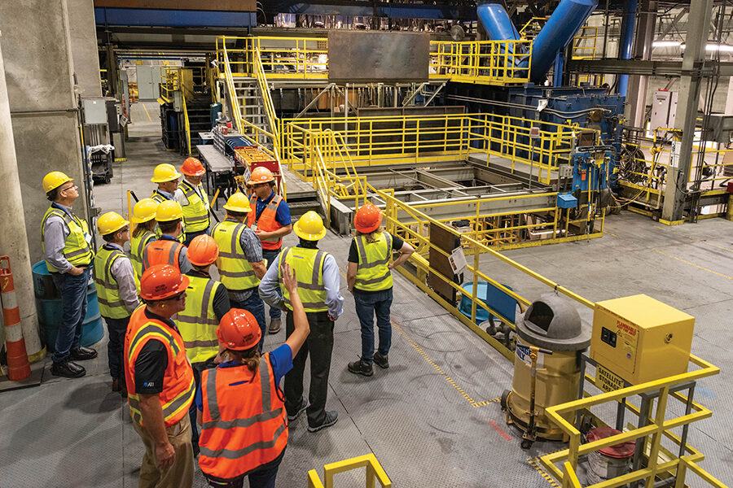

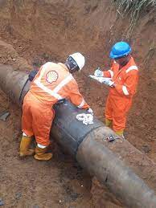

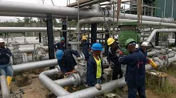

Complete FEED, fabrication, and installation services for a major manufacturing plant expansion in Rivers State.

### Process Facility Upgrade

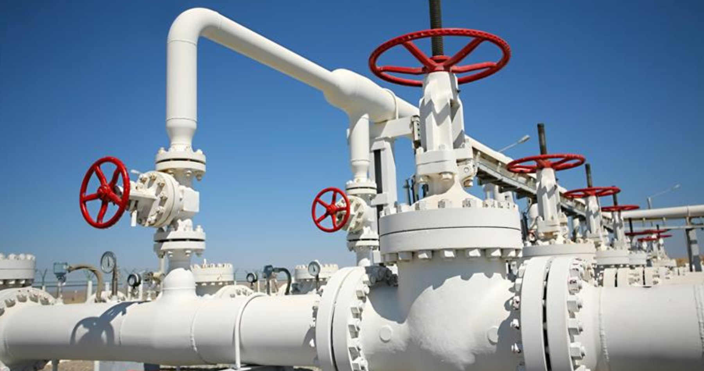

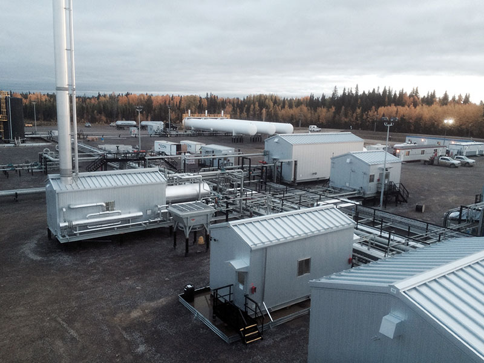

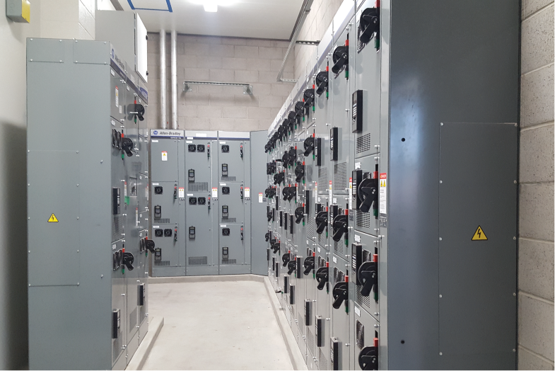

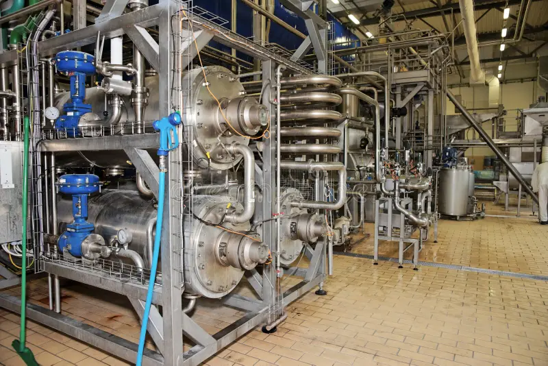

Engineering and installation services for upgrading a process facility to improve efficiency and capacity.

### Power Generation Equipment Installation

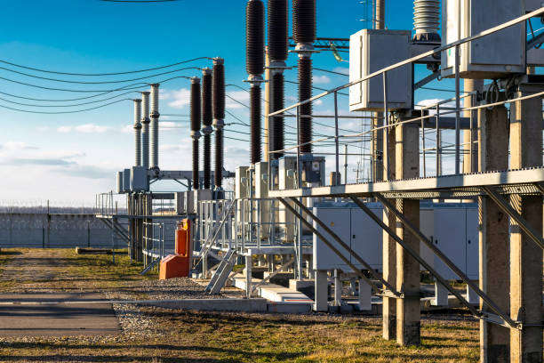

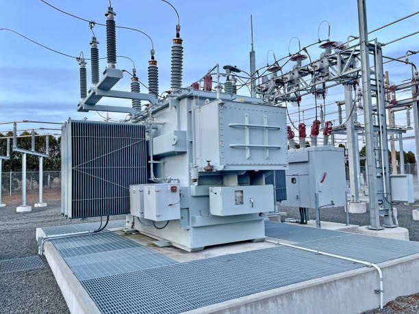

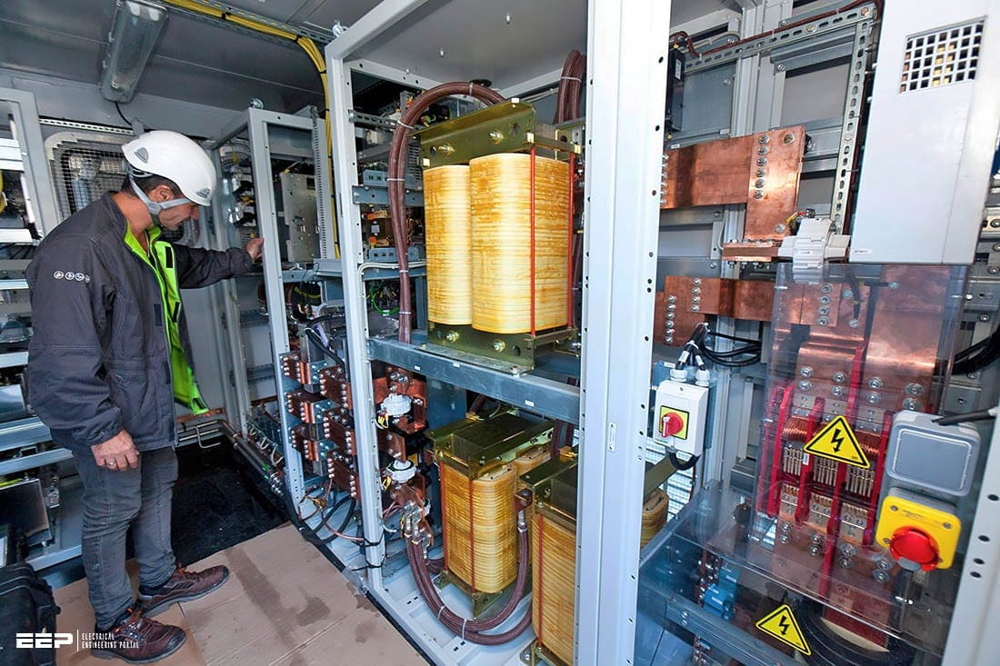

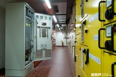

Installation and commissioning of power generation equipment for an industrial client.

## Our Engineering Approach

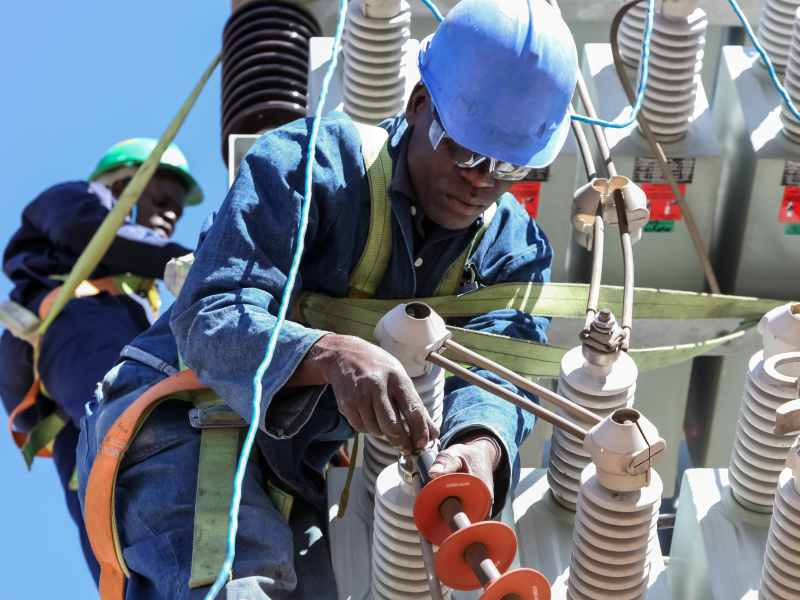

__

### Collaborative Engagement

We work closely with our clients to understand their specific requirements and objectives. Through open communication and collaboration, we ensure that our solutions are tailored to meet your needs.

__

### Technical Excellence

Our team brings extensive technical expertise and industry experience to every project. We stay updated with the latest engineering practices and technologies to deliver innovative and effective solutions.

__

### Quality Assurance

Quality is at the core of our engineering services. We implement robust quality control processes throughout the project lifecycle to ensure that all deliverables meet the highest standards.

__

### Safety Focus

Safety is our top priority in all engineering activities. We integrate safety considerations into our designs and implementation strategies, adhering to international standards and best practices.

__

### Efficiency and Cost-Effectiveness

We strive to optimize resource utilization and costs without compromising on quality. Our engineering solutions focus on efficiency and long-term value, delivering the best return on investment for our clients.

## Need Engineering Services?

Contact us today to discuss your project requirements and how our engineering team can help you achieve your goals.

[Contact Our Engineering Team](../contact.html)