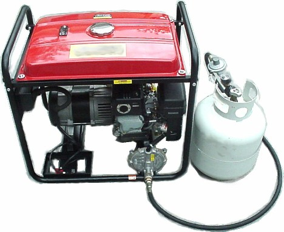

## Gas Conversion Expertise

We have developed strong expertise in gas conversion technologies, having entered into mutual agreements with our team of foreign technology providers that possess well-proven, commercially viable & patented technologies in gas conversion specifically to various natural gas liquids and other intended products. These Technologies come in compact and modular units.

### Our Gas Conversion Technologies Include:

  * __Flare gas to Diesel or Gasoline
  * __Flare gas to LNG, CNG or LPG
  * __Modular gas to Power technologies
  * __Natural gas to Blue Ammonia
  * __Natural gas to Blue Hydrogen

## Combustion Engines | Dual Fuel Technology & Support Services

As part of our contribution to the actualization of the Nigerian Gas Masterplan, we have developed great capability in Autogas Technologies. We make use of Italian Standard Sequential CNG kits that are the latest in CNG Autogas technology. We install these kits in your vehicles or Power generators professionally with minimal damages and offer Bi-annual checks and certifications for your assets.

### Our Dual Fuel Services Include:

  * __ PMS and Auto-CNG for light duty vehicles including Tricycles
  * __ AGO and Auto-CNG for heavy duty vehicles
  * __ Installation of CNG Module for Modular power generation
  * __ Installation of LNG Module for Industrial Power generators
  * __ Post-Installation Support services
  * __ Sales of Quality parts and Accessories

## Benefits of Gas Conversion

__

### Cost Savings

Significant reduction in fuel costs for vehicles and generators compared to traditional fuels.

__

### Environmental Impact

Lower carbon emissions and reduced environmental footprint with cleaner burning fuels.

__

### Fuel Flexibility

Dual-fuel capability provides flexibility to switch between traditional and alternative fuels.

__

### Performance

Maintained or improved engine performance with proper gas conversion technologies.

## Ready to transform your energy solutions?

Contact us today to discuss how our gas conversion technologies can benefit your business.

[Contact Us](../contact.html)