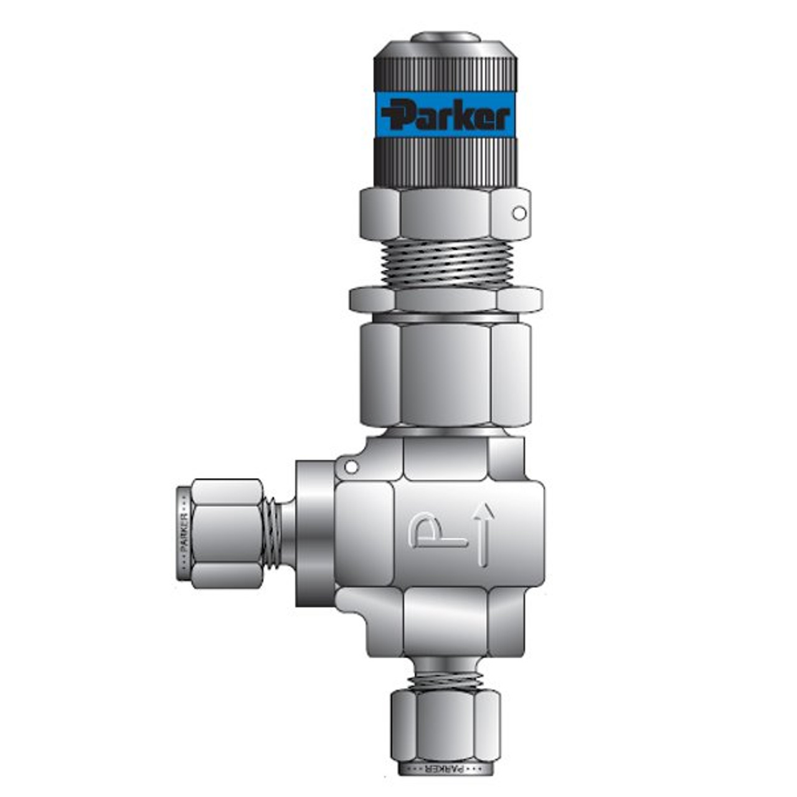
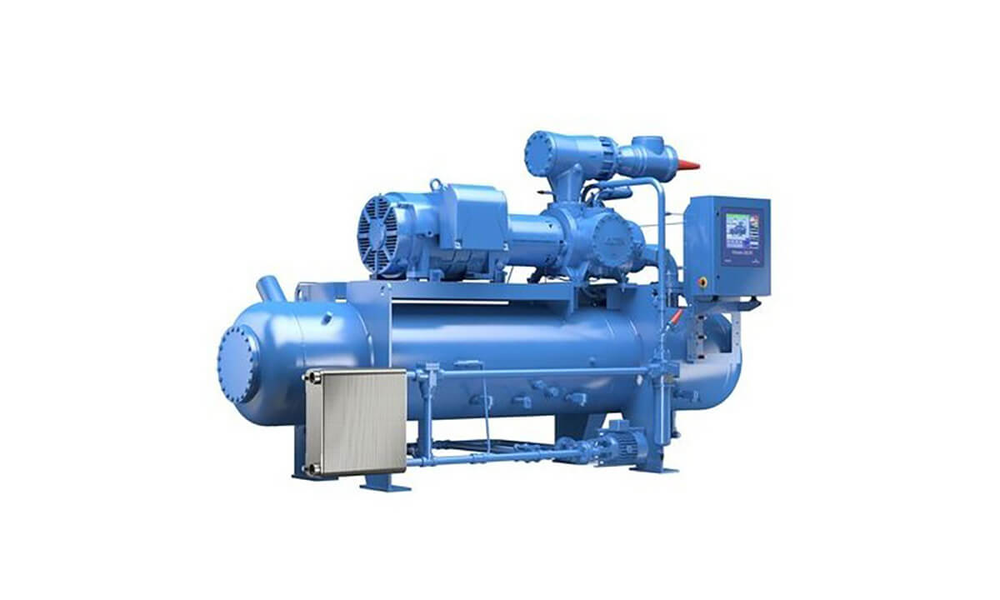
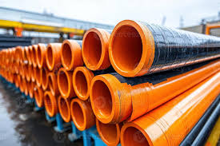
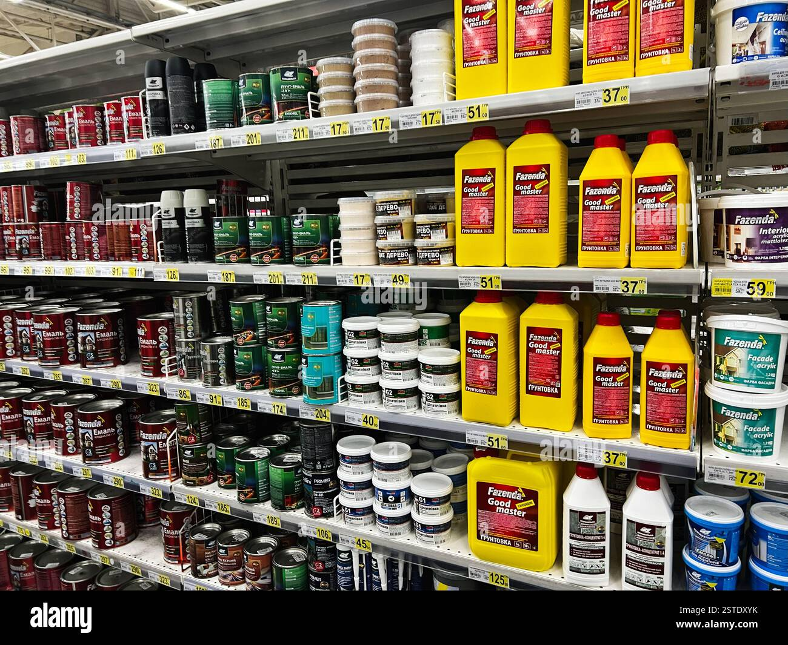
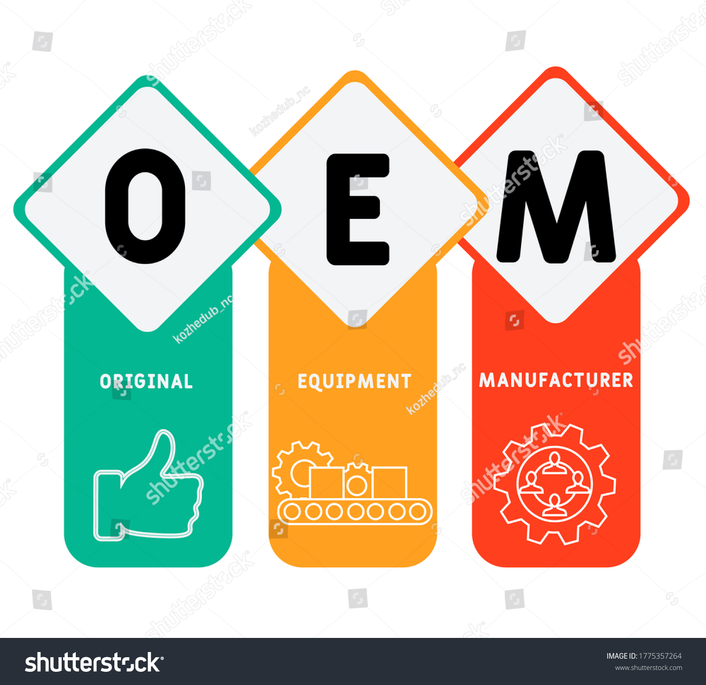
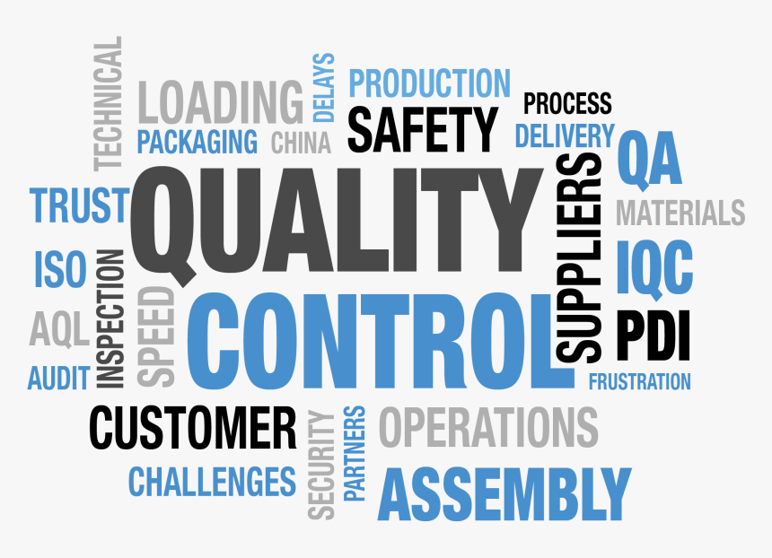
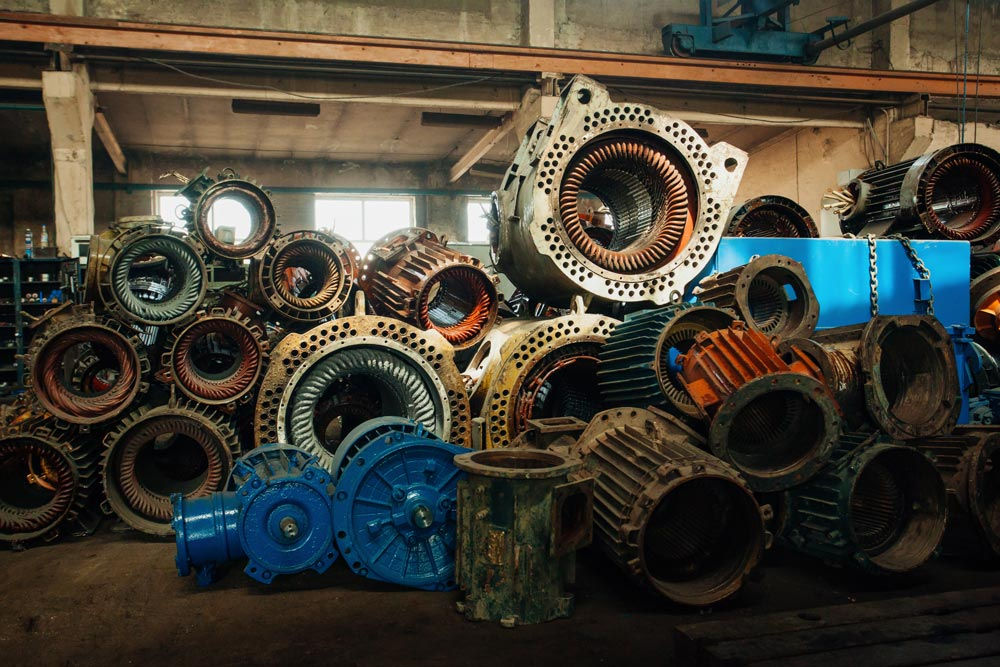

## Our Procurement Portfolio

#### PSVs And PRVs

SEESL offers Valves of different Sizes including Pressure Safety Valves (PSVs) and Pressure Relief Valves (PRVs).

#### Pumps And Compressors

SEESL offers durable high-performance Pumps, Compressors, and heavy-duty equipment for various industrial applications.

#### Casing And Tubes

We supply welded & seamless OCTG – casing & tubing of all sizes, drill pipes, seamless pipes, and SAW welded pipes.

#### Instrumentation And Electrical Materials

SEESL offers a comprehensive range of Instrumentation and electrical materials and parts for diverse project needs.

#### Sealants, Binders, Solvents

We procure Specialty Chemicals including high-quality sealants, binders, and solvents for all industrial purposes.

#### OEM Spares

SEESL equally offers genuine OEM Spares, Consumables, and Utility materials to ensure optimal equipment performance.

## Our Strategic Approach

SEESL achieves procurement excellence through a global network of reputable buying houses and Original Equipment Manufacturers (OEMs), with whom we have strategic alliances incorporating our well-developed supply chain process.

#### Global Network & OEM Alliances

Leveraging strong relationships with international suppliers and OEMs to source high-quality, authentic materials at competitive prices.

#### Developed Supply Chain Process

Our refined supply chain ensures timely delivery, inventory management, and logistical efficiency, minimizing project delays.

#### Rigorous Quality Assurance

Our quality assurance program, supported by advanced labs and equipment, ensures inspection and testing of materials, welding, dimensions, and coatings.

## SEESL Supplies:

Our comprehensive procurement capabilities cover a wide array of essential industrial products:

  * __Welded & seamless OCTG – casing & tubing of all sizes, drill pipes of all sizes, seamless pipes and SAW welded pipes of different sized.
  * __Valves of different Sizes including PSVs and PRVs.
  * __Instrumentation and electrical materials and parts.
  * __Pumps, Compressors and heavy-duty equipment.
  * __Portable handheld field electronic equipment.
  * __Drilling and production Chemicals including Stationaries.
  * __Specialty Chemicals including sealants, binders, solvents etc.
  * __OEM Spares, Consumables and Utility materials.

## Procurement Success Highlights

__

#### Project Alpha: Critical Spares

Sourced and delivered critical spare parts for a major refinery, significantly reducing operational downtime.

#### Pipeline Project: Material Supply

Managed end-to-end procurement of materials for a large-scale pipeline, ensuring on-time project completion.

#### Client Omega: Cost Optimization

Achieved substantial cost savings on annual procurement spend through strategic sourcing for a key client.

__

## Streamline Your Supply Chain with SEESL

Partner with us for reliable and efficient procurement services. Let's discuss how we can support your project's success.

[Request a Consultation](../contact.html)