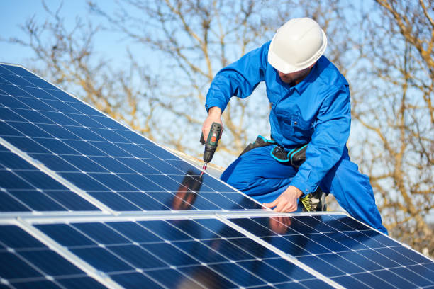
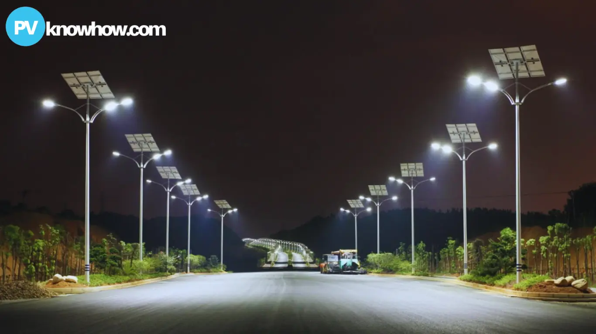

## Sustainable Energy Solutions

SEES is helping clients across the global energy industry to shift to low carbon and renewable sources while meeting increasing global demand. Whether it's investment or transaction advice, energy system integration, or the detailed design of energy infrastructure, we help clients to chart a sustainable path forward.

### Our Renewable Energy Services Include:

  * __Energy Audits
  * __Mini-grid Design and Development
  * __O &M Services
  * __Procurement and Installation of Solar Street Lightings
  * __Homes and Estates Solar Installations
  * __Green Hydrogen Production and Storage
  * __Green Ammonia Production and Storage
  * __Solar powered irrigation projects
  * __Inspection, Maintenance & Drone Cleaning of Solar Panels & Equipment

## Our Renewable Energy Solutions

__

### Solar Power Systems

Complete design and installation of solar power systems for residential, commercial, and industrial applications.

__

### Solar Street Lighting

Energy-efficient solar street lighting solutions for urban and rural areas, improving safety and reducing electricity costs.

__

### Solar Irrigation

Solar-powered irrigation systems that enable sustainable agricultural practices and reduce dependency on fossil fuels.

__

### Green Hydrogen

Production, storage, and utilization solutions for green hydrogen as a clean energy carrier and industrial feedstock.

## Featured Renewable Energy Projects

### Residential Solar Installation

Complete off-grid solar solution for residential estate with battery storage system.

### Solar Street Lighting

Installation of solar-powered street lights in community areas, enhancing safety and security.

### Solar Irrigation System

Implementation of solar-powered irrigation system for agricultural projects, increasing productivity.

### Mini-grid Development

Design and installation of mini-grid system providing reliable power to rural communities.

## Ready to transition to renewable energy?

Contact us today to discuss how our renewable energy solutions can help you achieve a more sustainable future.

[Contact Us](../contact.html)