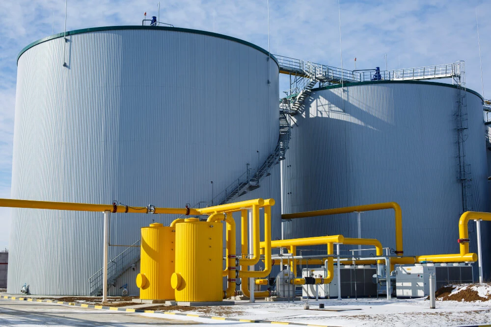
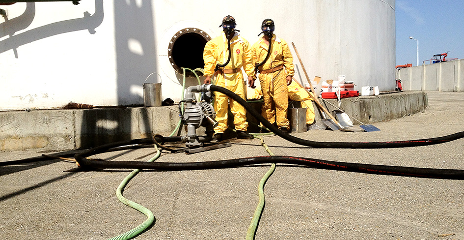
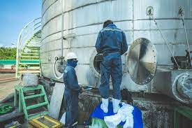
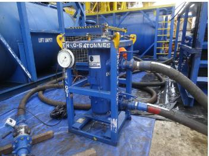

## Innovative Tank Cleaning Solutions

In safety conscious work-places today, the best option is the no-man entry into a confined space. In accordance with this, SEES has developed and adopted a range of technologies and methods using automated tank cleaning heads, vacuum transfer systems and other pumping solutions to clean tanks and vessels either remotely or with minimum man entry.

We trust that with our broad and exceptional range of engineering expertise, we would be able to meet our customers' needs and demands. We would be proud to earn your business and become partners in the industry. Allow us the opportunity to serve you. You will experience first class service along with best-in-class products.

### Our Tank Cleaning Services Include:

  * __Automated Cleaning of Petroleum Products Storage Tanks (Onshore/Offshore)
  * __Automated Cleaning of Pressure Vessels
  * __Automated Cleaning of Water Storage Tanks
  * __Automated Cleaning of Liquid Product Storage Containers (Pharmaceuticals/FMCGs/Breweries)
  * __Waste Management and Disposal
  * __Sludge Treatment and Recovery

## Our Advanced Cleaning Technologies

__

### Automated Cleaning Systems

Remote-controlled cleaning equipment that minimizes human entry into confined spaces, enhancing safety while delivering thorough cleaning results.

__

### Vacuum Transfer Systems

Powerful vacuum systems that efficiently remove sludge, sediment, and residues from tanks and vessels without manual intervention.

__

### High-Pressure Water Jetting

Specialized high-pressure water systems that effectively clean tank walls and remove stubborn deposits without chemical use.

__

### Waste Recovery Systems

Advanced filtration and separation technologies that recover valuable products from waste and minimize environmental impact.

## Benefits of Our Tank Cleaning Services

__

### Enhanced Safety

Minimizes or eliminates the need for human entry into confined spaces, significantly reducing safety risks.

__

### Environmental Compliance

Our methods ensure proper handling and disposal of waste materials in compliance with environmental regulations.

__

### Reduced Downtime

Automated systems work faster than traditional methods, minimizing operational disruptions.

__

### Cost Efficiency

Recovery of valuable product from sludge and waste can offset cleaning costs and provide additional revenue streams.

## Our Tank Cleaning Projects

### Petroleum Storage Tank Cleaning

Successfully completed automated cleaning of a 10,000-barrel crude oil storage tank with minimal downtime and zero safety incidents.

### Water Storage Tank Cleaning

Performed no-entry cleaning of municipal water storage tanks, maintaining water quality standards throughout the process.

### Pressure Vessel Cleaning

Utilized specialized equipment to clean industrial pressure vessels, restoring optimal operational efficiency.

## Ready to modernize your tank cleaning approach?

Contact us today to discuss how our automated tank cleaning solutions can enhance safety and efficiency for your operations.

[Contact Us](../contact.html)